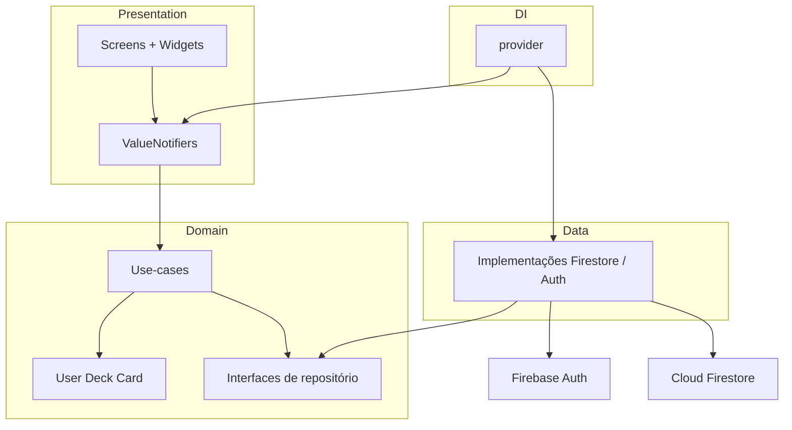

# Plan técnico — Andenken v1

> **Tipo:** Artefato de especificação (GitHub Spec Kit)
> **Versão:** 1.4.0
> **Produto:** [`spec.md`](spec.md)
> **Princípios:** [`constitution.md`](constitution.md)

Este documento define *como* construir a v1. Não substitui o spec.

---

## 1. Contexto técnico

| Item | Escolha |
|------|---------|
| App | Flutter (projeto existente `andenken_app`, hoje scaffold) |
| SDK | Dart `^3.12.1` (já no `pubspec.yaml`) |
| Alvos v1 | Android (`com.turial_dev.andenken.app`). Sem Firebase no iOS. |
| Firebase project | `andenken-ed808` (os três flavors apontam para este projeto na v1) |
| Flavors | `develop`, `homolog`, `prod` — mesmo `applicationId` e mesmo Firebase |
| Backend | Firebase Auth + Cloud Firestore |
| Estado | `ValueNotifier` + `ValueListenableBuilder` |
| DI | `provider` (somente injeção) |
| Rotas | `go_router` |
| Design | Google Stitch via MCP `stitch` (fonte visual oficial) |
| Idioma da UI | pt-BR |
| Testes | TDD (`flutter_test`): domínio e notifiers primeiro; widget só em fluxo crítico |

### Dependências a adicionar

| Pacote | Uso |
|--------|-----|
| `firebase_core` | Init |
| `firebase_auth` | Email + senha |
| `cloud_firestore` | Decks e Cards |
| `provider` | DI |
| `go_router` | Rotas + redirects de auth |
| `uuid` | IDs de Deck e Card no cliente |

Sem `freezed`, `json_serializable`, Riverpod, Bloc, Hive, Dio.

### 1.1 Design handoff (Stitch MCP)

| Item | Valor |
|------|--------|
| Ferramenta | Google Stitch |
| Acesso do agente | MCP `stitch` (`https://stitch.googleapis.com/mcp`) |
| Config local | `.cursor/mcp.json` (gitignored); template em `.cursor/mcp.json.example` |
| Credencial | `STITCH_API_KEY` no ambiente / Cursor; **nunca** no repo nem em `docs/` |
| Artefatos úteis | screenshot do frame, HTML, [`docs/stitch/DESIGN.md`](stitch/DESIGN.md) |
| Projeto Stitch | Andenken Flashcards (`projects/10397297006861135646`) |
| Artefato proibido em `lib/` | export Flutter/React/HTML do Stitch |

#### Fluxo por tela

1. Spec define rota e aceite ([`spec.md`](spec.md) §7).
2. Agente puxa o frame no Stitch via MCP (nome na tabela §7.1).
3. Extrai tokens uma vez → `lib/core/theme/app_theme.dart`; depois só delta.
4. Use-case e `ValueNotifier` já verdes (TDD, §1.2). Só então implementa a `*Screen` no layout Stitch.
5. Aceite = comportamento do spec **e** layout reconhecível do Stitch (espaçamento, tipo, hierarquia — não pixel-perfect na v1).

Fallback se o MCP estiver offline ou sem auth: PNG + `DESIGN.md` anexados no chat, mesmos nomes da §7.1.

#### Fora

- Não gerar/implementar tela no Stitch que o spec não tenha (onboarding, share, stats).
- Não trocar 6 grades por 4 botões Anki porque o Stitch gerou assim.
- Não commitar a API key. Se vazou, rotacionar no Google Cloud.

### 1.2 Test-Driven Development

Paradigma: **spec → teste vermelho → código → verde → refactor → UI Stitch**. O spec é o oráculo; o teste é o contrato executável. Ver constitution P-09.

#### Ciclo por task de regra

1. Ler o RN / user story / tabela SM-2.
2. Escrever o teste que falha (`flutter test` vermelho). Sem implementar o use-case ainda.
3. Implementar o mínimo em `lib/domain` (ou notifier) até verde.
4. Refactor sem mudar o comportamento.
5. Só então a `*Screen` Stitch.

Fases 0–1 (Firebase, theme, router) não têm regra de domínio — TDD não se aplica. Isolamento entre users e passe US-01–US-06 continuam manuais (Fase 7).

#### Pirâmide da v1

| Camada | TDD? | Como |
|--------|------|------|
| Domínio / use-cases | Sempre | `test/domain/` — `ApplySM2`, validações, `ReviewCard`, `ListDueCards` |
| Notifiers de fluxo | Sempre | `test/presentation/` — sobretudo `StudyNotifier` (fila, fases, RN-S08) |
| Repositórios Firebase | Não | Use-cases contra **fake** in-memory; SDK real só no device |
| Telas Stitch | Não | Layout depois do verde; widget test só em redirect de auth e fases do estudo, se couber |

Sem `mockito` obrigatório. Fakes manuais das interfaces (T023) — alinhado ao SOLID. Sem Firebase emulator e sem meta de 100% coverage.

#### Pastas de teste

```
test/
  fakes/
    fake_auth_repository.dart
    fake_deck_repository.dart
    fake_card_repository.dart
  domain/
    apply_sm2_test.dart
    end_of_local_day_test.dart
    usecases/
      ...
  presentation/
    study_notifier_test.dart
    auth_notifier_test.dart
```

Agente: para cada task de regra, o primeiro commit (ou o primeiro passo) é o teste vermelho. Não pular o vermelho.

### 1.3 Flavors (develop / homolog / prod)

Separação de **ambiente no app**, não de backend. Na v1 os três flavors usam o mesmo projeto Firebase (`andenken-ed808`) e o mesmo Android app (`com.turial_dev.andenken.app`). Não usar `applicationIdSuffix` ainda — isso exigiria três apps no Firebase e três entradas no `google-services.json`.

| Flavor | Nome visível | Firebase | `applicationId` |
|--------|--------------|----------|-----------------|
| `develop` | Andenken Dev | `andenken-ed808` | `com.turial_dev.andenken.app` |
| `homolog` | Andenken Homolog | `andenken-ed808` | `com.turial_dev.andenken.app` |
| `prod` | Andenken | `andenken-ed808` | `com.turial_dev.andenken.app` |

Consequência: não dá para instalar os três APKs no mesmo device ao mesmo tempo (mesmo id). A separação serve para banner, logs, e para trocar de projeto Firebase depois sem refazer a estrutura.

#### Android (`app/build.gradle.kts`)

Uma `flavorDimension` `"environment"` e três `productFlavors` com os nomes acima. `resValue` de `app_name` por flavor. `namespace` e `applicationId` iguais nos três.

Com flavors definidos, `flutter run` **sem** `--flavor` falha. Comando padrão da v1:

```bash
flutter run --flavor develop --dart-define=FLAVOR=develop
flutter run --flavor homolog --dart-define=FLAVOR=homolog
flutter run --flavor prod --dart-define=FLAVOR=prod
```

`flutter test` não exige flavor.

#### Dart

`lib/core/flavor/flavor.dart`:

- enum `AppFlavor { develop, homolog, prod }`
- `FlavorConfig` lido de `String.fromEnvironment('FLAVOR', defaultValue: 'develop')`
- getters: `isProd`, `showFlavorBanner` (true se não for `prod`)

Um único `main.dart` e um único `firebase_options.dart`. Sem `main_develop.dart` / `main_prod.dart` na v1.

UI: banner discreto (Dev / Homolog) fora de prod — não precisa frame Stitch.

#### Depois da v1 (não fazer agora)

- `applicationIdSuffix` (`.dev`, `.homolog`) + registrar apps extras no Firebase
- Projetos Firebase separados por flavor
- Flavors iOS (schemes/xcconfig)

---

## 2. Arquitetura

Camadas simples. Dependências apontam para dentro: presentation → domain ← data.

```
presentation  →  domain  ←  data  →  Firebase
```



### Responsabilidades

| Camada | Pode | Não pode |
|--------|------|----------|
| Presentation | Widgets, `ValueNotifier`, chamar use-cases | Fórmula SM-2, path Firestore |
| Domain | Entidades, validação, `ApplySM2`, contratos | Import Flutter Material, Firebase |
| Data | Mapear DTO ↔ entidade, SDK Firebase | Regra de intervalo/EF |

O `domain` pode importar `foundation.dart` só se necessário para `DateTime`; preferir Dart puro.

---

## 3. Estrutura de pastas

```
lib/
  main.dart
  app.dart
  firebase_options.dart          # gerado pelo FlutterFire CLI
  core/
    flavor/
      flavor.dart                # AppFlavor + FlavorConfig
    router/
      app_router.dart
    theme/
      app_theme.dart
    firebase/
      firebase_init.dart
  domain/
    entities/
      user.dart
      deck.dart
      card.dart
    repositories/
      auth_repository.dart       # abstract
      deck_repository.dart
      card_repository.dart
    usecases/
      apply_sm2.dart             # puro
      sign_in.dart
      sign_up.dart
      sign_out.dart
      watch_current_user.dart
      list_decks.dart
      create_deck.dart
      rename_deck.dart
      delete_deck.dart
      list_cards.dart
      create_card.dart
      update_card.dart
      delete_card.dart
      list_due_cards.dart
      review_card.dart           # ApplySM2 + persistir
  data/
    dto/
      deck_dto.dart
      card_dto.dart
    firebase/
      firebase_auth_repository.dart
      firestore_deck_repository.dart
      firestore_card_repository.dart
  presentation/
    auth/
      login_screen.dart
      register_screen.dart
      auth_notifier.dart
    decks/
      deck_list_screen.dart
      deck_form_screen.dart
      deck_detail_screen.dart
      deck_list_notifier.dart
      deck_detail_notifier.dart
    cards/
      card_form_screen.dart
    study/
      study_screen.dart
      study_notifier.dart
    widgets/
      ...

test/
  fakes/
    fake_auth_repository.dart
    fake_deck_repository.dart
    fake_card_repository.dart
  domain/
    apply_sm2_test.dart
    end_of_local_day_test.dart
    usecases/
  presentation/
    study_notifier_test.dart
```

Nomes de arquivo em snake_case. Entidade `Card` do domínio: `domain/entities/card.dart` — nunca colidir com `package:flutter/material.dart` `Card` na mesma unidade sem prefixo (`andenken_card.dart` só se o conflito incomodar; preferir import prefixado).

---

## 4. Injeção de dependência

Em `app.dart`, um `MultiProvider` acima do `MaterialApp.router`:

- `AuthRepository` → `FirebaseAuthRepository`
- `DeckRepository` → `FirestoreDeckRepository`
- `CardRepository` → `FirestoreCardRepository`
- Use-cases construídos com esses repositórios (construtor explícito)

`ValueNotifier`s **não** são singletons globais. Cada tela cria o notifier (ou um `ChangeNotifierProvider` local da rota) e dá `dispose`. `provider` não guarda estado de lista/sessão no root, só serviços.

Leitura na UI: `context.read<ReviewCard>()` / `context.watch` só para serviços. Estado de tela: `ValueListenableBuilder`.

---

## 5. Navegação

`go_router` com `refreshListenable` no stream do Auth.

| Path | Builder |
|------|---------|
| `/login` | `LoginScreen` |
| `/register` | `RegisterScreen` |
| `/decks` | `DeckListScreen` |
| `/decks/new` | `DeckFormScreen` (create) |
| `/decks/:deckId` | `DeckDetailScreen` |
| `/decks/:deckId/edit` | `DeckFormScreen` (rename) |
| `/decks/:deckId/cards/new` | `CardFormScreen` (create) |
| `/decks/:deckId/cards/:cardId/edit` | `CardFormScreen` (edit) |
| `/decks/:deckId/study` | `StudyScreen` |

Redirect:

- Sem user e path autenticado → `/login`
- Com user e path `/login` ou `/register` → `/decks`
- `/` → `/decks` (ou `/login`)

Deep links não são aceite da v1, mas as URLs acima já permitem.

---

## 6. Firebase e dados

### 6.1 Auth

- `createUserWithEmailAndPassword` / `signInWithEmailAndPassword` / `signOut`
- `authStateChanges()` alimenta o router
- Sem documento em `users/{uid}`

Mapeamento User:

```
id        ← user.uid
email     ← user.email
createdAt ← user.metadata.creationTime
```

### 6.2 Firestore

```
users/{uid}
  decks/{deckId}
    name: string
    createdAt: timestamp
    updatedAt: timestamp | omitido
    cards/{cardId}
      frontText: string
      backText: string
      repetitions: number
      intervalDays: number
      easeFactor: number
      nextReviewAt: timestamp
      lastReviewedAt: timestamp | null
      createdAt: timestamp
      updatedAt: timestamp
```

O documento `users/{uid}` **não precisa existir**. É só prefixo de path. `userId` do Deck é o `{uid}` do path — não duplicar no documento, ou duplicar só se facilitar regra/query; preferir **não duplicar** `userId`/`deckId` no documento (já estão no path). No domínio, preencher `userId` e `deckId` ao hidratar o DTO.

`cards` **nunca** é array no documento do Deck.

Queries:

- Listar Decks: `users/{uid}/decks` orderBy `createdAt`
- Listar Cards: `users/{uid}/decks/{deckId}/cards` orderBy `createdAt`
- Due: `cards` where `nextReviewAt <= endOfToday` orderBy `nextReviewAt`  
  (índice composto se o Firestore pedir)

Delete em cascata: na v1, o use-case `DeleteDeck` lista os Cards e apaga um a um, depois o Deck. Sem Cloud Function.

### 6.3 Regras de segurança (esboço)

```
rules_version = '2';
service cloud.firestore {
  match /databases/{database}/documents {
    match /users/{uid}/decks/{deckId} {
      allow read, write: if request.auth != null && request.auth.uid == uid;
      match /cards/{cardId} {
        allow read, write: if request.auth != null && request.auth.uid == uid;
      }
    }
  }
}
```

Validação de tamanho/tipos pode ser incrementada depois; a UI já valida. Sem regra, não há aceite de isolamento.

### 6.4 Offline

Persistência local padrão do Firestore no mobile. Sem fila própria. A UI trata falha de rede com mensagem; cache pode mostrar dados antigos.

---

## 7. Use-cases principais

### `ApplySM2` (puro)

```
entrada: Card + grade (0–5)
saída:   Card com easeFactor, intervalDays, repetitions,
         nextReviewAt, lastReviewedAt, updatedAt
```

Implementar a seção 6 de [`algoritmo-SM-2.md`](algoritmo-SM-2.md). Sem I/O.

### `ReviewCard`

1. Carrega Card (ou recebe o da fila).
2. `ApplySM2`.
3. Persiste.
4. Devolve o Card atualizado para o `StudyNotifier` decidir reenfileirar (`grade < 4`).

### CRUD

Use-cases finos em cima dos repositórios. Validação de nome/frente/verso no use-case ou numa função de domínio pequena — não no widget.

---

## 8. Estado das telas (ValueNotifier)

| Notifier | Valor típico |
|----------|----------------|
| `AuthNotifier` | `{ idle \| loading \| error }` + ações login/register/logout |
| `DeckListNotifier` | `{ loading \| data \| error }` + lista + contagem due por deck |
| `DeckDetailNotifier` | Deck + lista de Cards |
| `StudyNotifier` | fila, índice, fase `front\|back\|done`, último grade |

Padrão: `ValueNotifier<ViewState<T>>` com `loading / data / error`, ou um record/`class` imutável por tela. Sem `setState` para dados remotos.

---

## 9. SM-2 na sessão

O `StudyNotifier`:

1. Pede `ListDueCards(deckId, now)`.
2. Mostra o primeiro.
3. No grade, chama `ReviewCard`.
4. Se `grade < 4`, coloca o Card **atualizado** no fim da fila (RN-S08).
5. Se `grade >= 4`, não reenfileira.
6. Fila vazia → `done`.

`ApplySM2` atualiza `nextReviewAt` mesmo quando o card volta hoje (falha ou grade 3). A refila é **só de sessão**, não muda a regra de due do dia seguinte.

---

## 10. Projeto Firebase (operacional)

Fora do código, mas bloqueia o app:

1. Criar projeto Firebase.
2. Ativar Auth email/senha.
3. Criar Firestore (modo produção + regras acima).
4. `flutterfire configure` **somente Android** → `lib/firebase_options.dart` (não commitar service account).
5. App Android no Firebase com o mesmo `applicationId` do Gradle:
   - Android: `com.turial_dev.andenken.app`
   - Sem app iOS, sem `GoogleService-Info.plist` na v1.

```bash
flutterfire configure --project=andenken-ed808 \
  --platforms=android \
  --android-package-name=com.turial_dev.andenken.app \
  --yes
```

O Gradle precisa de `applicationId = "com.turial_dev.andenken.app"` (não o id antigo `...andenken_app`). A pasta `ios/` do scaffold pode permanecer; `flutter run` em iOS **não** é aceite da v1.

Os flavors `develop` / `homolog` / `prod` **não** mudam o projeto Firebase na v1. `Firebase.initializeApp` usa o mesmo `DefaultFirebaseOptions` em todos. Ver §1.3.

---

## 11. Ordem de build

Resumo; o detalhe está em [`tasks.md`](tasks.md).

1. Firebase + pacotes + flavors (`develop`/`homolog`/`prod`) + `core/` (init, theme a partir do Stitch, router vazio).
2. Domain em TDD: entidades + fakes + testes vermelhos do SM-2 + `ApplySM2` verde.
3. Auth: use-cases TDD (fake) → Firebase → telas Stitch.
4. Decks CRUD no mesmo ciclo.
5. Cards CRUD no mesmo ciclo.
6. Estudo: `ReviewCard` / `StudyNotifier` TDD → tela Stitch + badge due.
7. Regras Firestore + passe manual das stories.

---

## 12. Riscos

| Risco | Mitigação |
|-------|-----------|
| Índice Firestore na query due | Criar índice assim que o SDK reclamar; documentar o link no PR |
| Delete Deck sem cascade nativo | Apagar Cards no use-case |
| Conflito de nome `Card` | Import prefixado |
| `firebase_options` ausente no clone | `tasks.md` inclui o passo FlutterFire |
| `flutter run` no iOS | Fora da v1; `firebase_options` só tem Android |
| `applicationId` ≠ `com.turial_dev.andenken.app` | Gradle e `google-services.json` precisam do mesmo package |
| `flutter run` sem `--flavor` | Depois da T017, sempre passar `--flavor` + `--dart-define=FLAVOR=` |
| `applicationIdSuffix` cedo demais | Quebra o `google-services.json` (um só package). Só depois de apps extras no Firebase |
| Relógio / fuso no due | Sempre “fim do dia local do device”, uma função só |
| MCP Stitch indisponível | Fallback PNG + `DESIGN.md`; não bloquear domínio/SM-2 |
| Stitch diverge do spec (ex.: 4 botões) | Spec vence; ajustar o frame depois |
| Implementar UI antes do teste | Constitution P-09: tela só depois do verde |
| Mock do Firestore SDK | Usar fake da interface; não acoplar teste ao vendor |

---

## 13. O que este plano não faz

- Instalar GitHub Spec Kit CLI
- Implementar código nesta etapa de documentação
- Definir CI, store listing ou analytics
- Colar export Flutter do Stitch em `lib/`
- Versionar a API key do MCP
- Exigir Firebase emulator ou 100% de coverage na v1
- TDD de layout Stitch (pixel-perfect)
- Configurar Firebase no iOS (`GoogleService-Info.plist`) na v1
- Projetos Firebase ou `applicationId` diferentes por flavor na v1
